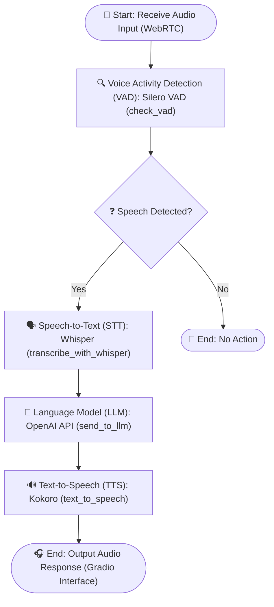

# FlexVoice
Flex on cloud-paid-APIs aproche with a flexible modular, easly upgradeable voice chat framework by swaps VAD, STT, LLM, and TTS in local pipeline for real-time voice assistants.

## ⭐ Features & Components

<details><summary>🔥 Fully local real-time voice chat via modular pipeline WebRTC>VAD>SST>LLM>TTS in Gradio interface:</summary>


## 📐 Structured Architecture in independent modules:
```python
def process_pipeline(audio, conversation):
    # 1. Voice Activity Detection: Audio array -> `check_vad()` ->  Boolean (speech detected)
    # 2. Speech-to-Text: Audio array -> `load_stt_models` and `transcribe_with_whisper(audio_array)` ->  Transcribed text
    # 3. LLM: Text prompt -> `send_to_llm` -> Text response
    # 4. Text-to-Speech: Text -> `initialize_tts`, `text_to_speech(text)` -> (audio_array, sample_rate)
```




</details>

  - 🎤 Voice Activity Detection: (Silero VAD)
  - 🗣️ Speech-to-Text [insanely-fast-whisper](https://github.com/Vaibhavs10/insanely-fast-whisper) 
  - 🤖 Language Model (OpenAI API format, local server)
  - 🔊 Text-to-Speech (Kokoro)
- 🤝 Contributing: Easy to modify - share your implementations!

## 🚀 Setup & Quick Start
```cmd
# 📜 Requirements: Python>=3.8+, cu118+ (CUDA Toolkit for Whisper) and server openai-API (default: ooba webui)
# 1. 🔧 Clone & Install dependencies:
git clone https://github.com/yourusername/ModuVoice.git && cd ModuVoice
python -m venv venv && venv\Scripts\activate
pip install -r requirements.txt
# 2. Run! Opens http://localhost:7861
python app.py
```
